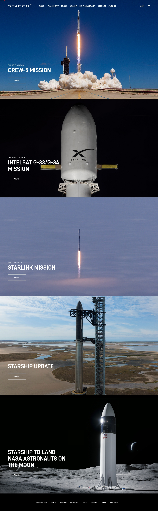

### SpaceX clone with HTML, CSS, and JavaScript

This is a clone of frontend design of SpaceX website with HTML, CSS, and JavaScript. This project was made for learning of the cool animations and effects that can be made with CSS and JavaScript which are present in the original SpaceX website. 

### Demo

You can see the demo of the project [here](https://tyzrex-spacexclone.netlify.app).

### Screenshots



.jpg)

### Tech Stack

- HTML
- CSS
- JavaScript

### Features

- Responsive design
- Animations and effects
- Smooth scrolling

### Run Locally

Clone the project

```bash
  git clone
```

Go to the project directory

```bash
  cd spacex-clone
```

Open the index.html file in your browser

